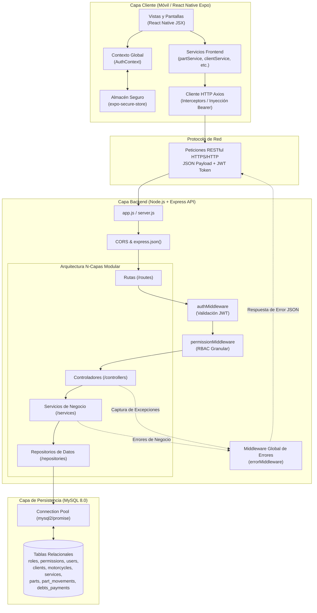
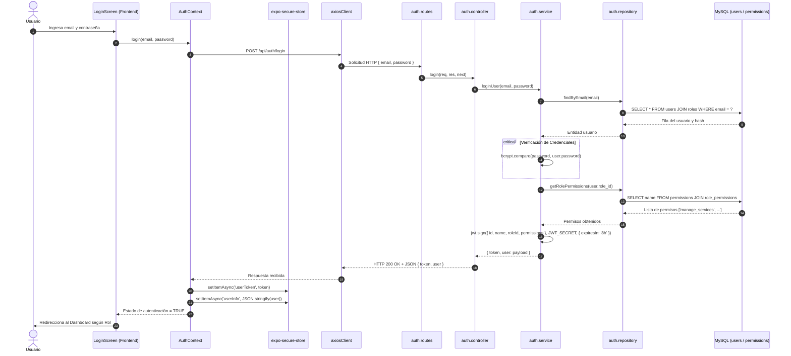
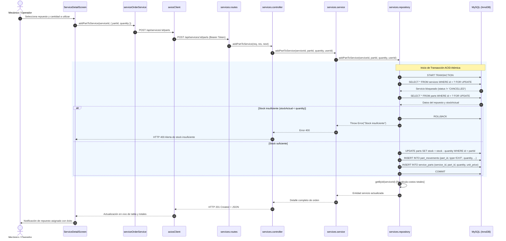
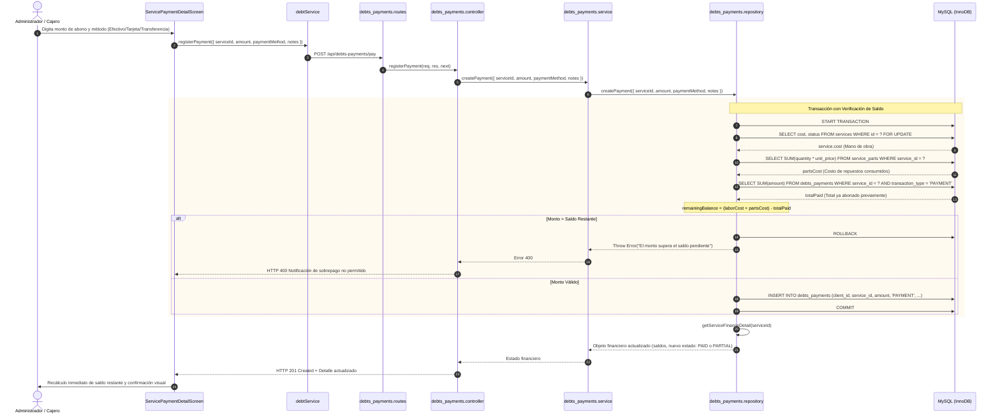
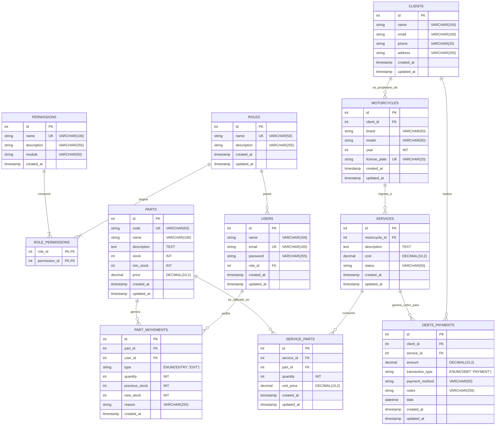

# Documentación Técnica Completa: Sistema de Gestión para Taller de Motocicletas

> **Versión del Sistema:** 1.0.0  
> **Compatibilidad:** Markdown Preview Enhanced (VS Code) / Mermaid.js  
> **Fecha de Documentación:** Octubre 2026  
> **Entorno:** Node.js (Express) + React Native (Expo SDK 56) + MySQL 8.0  

---

## Tabla de Contenidos
1. [Resumen Ejecutivo y Arquitectura General](#1-resumen-ejecutivo-y-arquitectura-general)
   - [1.1 Propósito del Sistema](#11-propósito-del-sistema)
   - [1.2 Stack Tecnológico y Dependencias Clave](#12-stack-tecnológico-y-dependencias-clave)
   - [1.3 Principios de Diseño y Patrones](#13-principios-de-diseño-y-patrones)
   - [1.4 Diagrama de Arquitectura de Alto Nivel](#14-diagrama-de-arquitectura-de-alto-nivel)
2. [Flujo de Datos y Componentes](#2-flujo-de-datos-y-componentes)
   - [2.1 Módulos Principales del Sistema](#21-módulos-principales-del-sistema)
   - [2.2 Modelo de Seguridad y RBAC Dinámico](#22-modelo-de-seguridad-y-rbac-dinámico)
   - [2.3 Diagramas de Secuencia de Flujos Clave](#23-diagramas-de-secuencia-de-flujos-clave)
     - [Flujo 1: Autenticación e Inyección de Credenciales](#flujo-1-autenticación-e-inyección-de-credenciales-jwt)
     - [Flujo 2: Asignación de Repuestos a Servicio con Descuento Atómico](#flujo-2-asignación-de-repuestos-con-descuento-atómico)
     - [Flujo 3: Registro de Pagos y Amortización Financiera](#flujo-3-registro-de-pagos-y-amortización-financiera)
3. [Estructura de Datos y Base de Datos](#3-estructura-de-datos-y-base-de-datos)
   - [3.1 Diagrama Entidad-Relación (ERD)](#31-diagrama-entidad-relación-erd)
   - [3.2 Diccionario de Datos y Especificación de Tablas](#32-diccionario-de-datos-y-especificación-de-tablas)
   - [3.3 Integridad Referencial y Reglas de Consistencia](#33-integridad-referencial-y-reglas-de-consistencia)
4. [Referencia de API RESTful y Métodos Clave](#4-referencia-de-api-restful-y-métodos-clave)
   - [4.1 Convenciones y Estándares de Respuesta HTTP](#41-convenciones-y-estándares-de-respuesta-http)
   - [4.2 Módulo de Autenticación (`/api/auth`)](#42-módulo-de-autenticación-apiauth)
   - [4.3 Módulo de Usuarios (`/api/users`)](#43-módulo-de-usuarios-apiusers)
   - [4.4 Módulo de Roles y Permisos (`/api/roles`)](#44-módulo-de-roles-y-permisos-apiroles)
   - [4.5 Módulo de Clientes (`/api/clients`)](#45-módulo-de-clientes-apiclients)
   - [4.6 Módulo de Motocicletas (`/api/motorcycles`)](#46-módulo-de-motocicletas-apimotorcycles)
   - [4.7 Módulo de Órdenes de Servicio (`/api/services`)](#47-módulo-de-órdenes-de-servicio-apiservices)
   - [4.8 Módulo de Inventario y Repuestos (`/api/parts`)](#48-módulo-de-inventario-y-repuestos-apiparts)
   - [4.9 Módulo de Finanzas y Pagos (`/api/debts-payments`)](#49-módulo-de-finanzas-y-pagos-apidebts-payments)
5. [Lógica de Negocio y Métodos Internos Clave](#5-lógica-de-negocio-y-métodos-internos-clave)
   - [5.1 Backend: Servicios Críticos](#51-backend-servicios-críticos)
   - [5.2 Frontend: Manejo de Estado, Axios y Conectividad](#52-frontend-manejo-de-estado-axios-y-conectividad)

---

## 1. Resumen Ejecutivo y Arquitectura General

### 1.1 Propósito del Sistema
El **Sistema de Gestión para Taller de Motocicletas** es una plataforma integral diseñada para digitalizar y orquestar las operaciones técnicas, administrativas y contables de un taller mecánico de motocicletas. Resuelve problemáticas críticas de operación:
- Control de acceso granular y roles dinámicos configurables (**RBAC**).
- Trazabilidad total de clientes y de las motocicletas que ingresan al taller.
- Emisión y control de estados de órdenes de servicio (`PENDING`, `IN_PROGRESS`, `COMPLETED`, `CANCELLED`).
- Control de inventario en tiempo real con historial de movimientos (Kárdex: entradas, salidas y motivos) y advertencias de stock crítico.
- Desglose transparente de costos de mano de obra y consumo de refacciones asociadas a cada servicio.
- Gestión de cobros, amortizaciones por abonos parciales o totales, monitoreo de deudas pendientes e indicadores financieros clave (KPIs).

### 1.2 Stack Tecnológico y Dependencias Clave

#### Backend
- **Entorno de Ejecución:** Node.js (v18+)
- **Framework Web:** Express.js (v4.19.2)
- **Base de Datos:** MySQL Server 8.0+
- **Conector de Base de Datos:** `mysql2/promise` (v3.9.7) utilizando *Connection Pooling* y transacciones ACID.
- **Seguridad y Criptografía:** 
  - `bcrypt` (v5.1.1): Hashing unidireccional de contraseñas con salting (10 rondas).
  - `jsonwebtoken` (JWT v9.0.2): Generación y validación de tokens de sesión con expiración configurable (default 8 horas).
- **Utilidades & Middleware:**
  - `cors` (v2.8.5): Habilitación controlada de Cross-Origin Resource Sharing.
  - `dotenv` (v16.4.5): Gestión de variables de entorno seguras (`.env`).
  - `swagger-ui-express` (v5.0.0): Visualización e integración de especificaciones OpenAPI.

#### Frontend
- **Framework:** React Native 0.85.3 sobre **Expo SDK 56** (Arquitectura moderna con React 19).
- **Navegación:** `@react-navigation/native` (v6.1.9) y `@react-navigation/native-stack` (v6.9.17).
- **Almacenamiento Seguro:** `expo-secure-store` (~56.0.4) para el resguardo de credenciales y tokens JWT con encriptación a nivel de hardware (Keychain en iOS / Keystore en Android).
- **Cliente HTTP:** `axios` (v1.6.8) configurado con interceptores de solicitud (inyección automática del encabezado `Authorization: Bearer <token>`) y respuesta (detección de expiración 401 y pérdida de red).
- **Renderizado de Interfaz & Gráficos:** `react-native-svg` (15.15.4), `react-native-screens`, `react-native-safe-area-context`.
- **Estandarización Estética:** Sistema centralizado de estilos y temas cromáticos (`src/theme/colors.js`).

### 1.3 Principios de Diseño y Patrones
1. **Arquitectura N-Capas Estricta en Backend:**
   - **Rutas (`/routes`):** Declaración de endpoints HTTP, vinculación de middlewares (`authMiddleware`, `permissionMiddleware`) y delegación al controlador.
   - **Controladores (`/controllers`):** Recepción de peticiones, validación preliminar de transporte, delegación a la capa de servicios y formateo de respuesta HTTP. Cero lógica de negocio.
   - **Servicios (`/services`):** Núcleo de la lógica de negocio, validaciones operativas, cálculos matemáticos y orquestación de transacciones. Aislado de dependencias de Express (`req`, `res`).
   - **Repositorios (`/repositories`):** Único punto de interacción con MySQL mediante sentencias parametrizadas (anti SQL Injection) y transacciones atómicas.
2. **Desacoplamiento en Frontend:**
   - Capa de Pantallas (*Views* mudas) $\rightarrow$ Capa de Servicios API $\rightarrow$ Cliente Axios centralizado $\rightarrow$ Almacén Seguro / Contexto Global (`AuthContext`).

### 1.4 Diagrama de Arquitectura de Alto Nivel



---

## 2. Flujo de Datos y Componentes

### 2.1 Módulos Principales del Sistema

| Módulo | Función Principal | Archivos Clave (Backend) | Vistas Clave (Frontend) |
| :--- | :--- | :--- | :--- |
| **Autenticación (Auth)** | Autenticación, generación de JWT, validación de credenciales con bcrypt y cierre de sesión. | `auth.routes.js`, `auth.controller.js`, `auth.service.js`, `auth.repository.js` | `LoginScreen.js`, `AuthNavigator.js` |
| **Usuarios y Roles (RBAC)** | Alta, modificación, baja de usuarios y definición dinámica de roles con permisos granulares. | `users.*.js`, `roles.*.js`, `permissions.repository.js` | `UserManagementScreen.js`, `AddUserScreen.js`, `RolesScreen.js`, `RoleFormScreen.js` |
| **Clientes** | Registro de clientes, búsqueda por nombre/teléfono/email y validaciones de contacto. | `clients.*.js` | `ClientsScreen.js`, `AddClientScreen.js`, `ClientInformationScreen.js` |
| **Motocicletas** | Inventario de unidades vehiculares ligadas a clientes, validación de placas únicas y años. | `motorcycles.*.js` | `MotorcyclesScreen.js`, `MotorcycleFormScreen.js`, `MotorcycleDetailScreen.js` |
| **Órdenes de Servicio** | Ciclo de vida de órdenes, vinculación de mano de obra y asignación/reintegro de repuestos. | `services.*.js` | `ServicesScreen.js`, `CreateServiceScreen.js`, `ServiceDetailScreen.js` |
| **Repuestos e Inventario** | Catálogo con SKU/código único, alertas de stock mínimo y registro de auditoría de movimientos. | `parts.*.js` | `PartsScreen.js`, `ModalRepuesto.js`, `ModalMovimiento.js` |
| **Finanzas y Pagos** | Amortización de órdenes, control de saldos pendientes, estados de cuenta y KPIs globales. | `debts_payments.*.js` | `DebtsScreen.js`, `ServicePaymentDetailScreen.js` |

### 2.2 Modelo de Seguridad y RBAC Dinámico
El sistema no codifica roles estáticos en el código fuente (a excepción de la salvaguarda del ID `1` de Administrador); en su lugar, implementa un catálogo relacional de permisos por módulo:

- `manage_users`: Creación, actualización y eliminación de usuarios.
- `manage_roles`: Creación, modificación de roles y asignación de permisos.
- `manage_clients`: Administración del directorio de clientes.
- `manage_motorcycles`: Registro y ficha técnica de motocicletas.
- `manage_services`: Control de órdenes de servicio y asignación de repuestos.
- `manage_parts`: Control de catálogo e inventario físico de repuestos.
- `manage_finances`: Registro de cobros, abonos e inspección de reportes financieros.

**Bypass de Integridad:** El usuario con `role_id = 1` (*Administrador*) posee acceso automático irrestricto sin importar la combinación asignada, y el sistema bloquea su alteración o eliminación para prevenir bloqueos de administración permanente.

---

### 2.3 Diagramas de Secuencia de Flujos Clave

#### Flujo 1: Autenticación e Inyección de Credenciales (JWT)



---

#### Flujo 2: Asignación de Repuestos con Descuento Atómico

Este flujo ilustra la protección ante condiciones de carrera (*Race Conditions*) utilizando transacciones y bloqueos pesimistas (`SELECT ... FOR UPDATE`).



---

#### Flujo 3: Registro de Pagos y Amortización Financiera

Muestra cómo el sistema calcula los costos combinados (mano de obra + refacciones), valida el saldo pendiente y previene sobrepagos.



---

## 3. Estructura de Datos y Base de Datos

### 3.1 Diagrama Entidad-Relación (ERD)



---

### 3.2 Diccionario de Datos y Especificación de Tablas

#### Tabla: `roles`
Almacena los roles disponibles en el taller.
- `id` (INT, PK, Auto-increment): Identificador único.
- `name` (VARCHAR(50), NOT NULL, UNIQUE): Nombre visible del rol (ej. `Administrador`, `Mecánico`, `Cajero`).
- `description` (VARCHAR(255), NULL): Resumen de responsabilidades.
- `created_at`, `updated_at` (TIMESTAMP): Marcas temporales automáticas.

#### Tabla: `permissions`
Catálogo maestro de permisos operacionales.
- `id` (INT, PK, Auto-increment): Identificador de permiso.
- `name` (VARCHAR(100), NOT NULL, UNIQUE): Clave unívoca del permiso (`manage_users`, `manage_roles`, etc.).
- `description` (VARCHAR(255), NOT NULL): Descripción legible para la interfaz gráfica de asignación.
- `module` (VARCHAR(50), NOT NULL): Módulo temático al que pertenece (`Usuarios`, `Roles`, `Clientes`, `Motocicletas`, `Servicios`, `Repuestos`, `Finanzas`).

#### Tabla: `role_permissions`
Tabla puente de cardinalidad muchos a muchos (N:M).
- `role_id` (INT, PK, FK $\rightarrow$ `roles.id`, ON DELETE CASCADE).
- `permission_id` (INT, PK, FK $\rightarrow$ `permissions.id`, ON DELETE CASCADE).

#### Tabla: `users`
Cuentas de usuario del sistema (empleados y administradores).
- `id` (INT, PK, Auto-increment): Identificador único.
- `name` (VARCHAR(100), NOT NULL): Nombre completo del empleado.
- `email` (VARCHAR(100), NOT NULL, UNIQUE): Correo corporativo para inicio de sesión.
- `password` (VARCHAR(255), NOT NULL): Hash Bcrypt con salt rounds.
- `role_id` (INT, NOT NULL, FK $\rightarrow$ `roles.id`, RESTRICT).

#### Tabla: `clients`
Expedientes de propietarios de motocicletas.
- `id` (INT, PK, Auto-increment): Identificador de cliente.
- `name` (VARCHAR(100), NOT NULL): Nombre completo.
- `email` (VARCHAR(100), NULL): Correo electrónico (validado con RegExp estándar).
- `phone` (VARCHAR(20), NULL): Número de contacto (validado a 8 dígitos).
- `address` (VARCHAR(255), NULL): Dirección física de residencia.

#### Tabla: `motorcycles`
Parque vehicular registrado en el taller.
- `id` (INT, PK, Auto-increment): Identificador de motocicleta.
- `client_id` (INT, NOT NULL, FK $\rightarrow$ `clients.id`, ON DELETE CASCADE).
- `brand` (VARCHAR(50), NOT NULL): Marca (ej. Honda, Yamaha, Suzuki).
- `model` (VARCHAR(50), NOT NULL): Modelo comercial.
- `year` (INT, NULL): Año de fabricación (validado entre 1950 y el año en curso + 1).
- `license_plate` (VARCHAR(20), UNIQUE, NOT NULL): Matrícula/Placa normalizada en mayúsculas.

#### Tabla: `services`
Órdenes de trabajo y mantenimiento.
- `id` (INT, PK, Auto-increment): Número de orden de servicio.
- `motorcycle_id` (INT, NOT NULL, FK $\rightarrow$ `motorcycles.id`, ON DELETE CASCADE).
- `description` (TEXT, NOT NULL): Descripción del fallo o trabajos solicitados.
- `cost` (DECIMAL(10,2), NOT NULL): Costo estipulado por mano de obra técnica.
- `status` (VARCHAR(50), DEFAULT `'PENDING'`): Estado de la orden (`PENDING`, `IN_PROGRESS`, `COMPLETED`, `CANCELLED`).

#### Tabla: `parts`
Catálogo e inventario de refacciones y consumibles.
- `id` (INT, PK, Auto-increment): Identificador interno.
- `code` (VARCHAR(50), NOT NULL, UNIQUE): Código SKU o referencia alfanumérica (`AC-102`, `FR-045`, etc.).
- `name` (VARCHAR(100), NOT NULL): Denominación del repuesto.
- `description` (TEXT, NULL): Especificaciones técnicas.
- `stock` (INT, NOT NULL, DEFAULT 0): Existencia física actual en bodega.
- `min_stock` (INT, NOT NULL, DEFAULT 10): Umbral para disparo de alertas de reposición.
- `price` (DECIMAL(10,2), NOT NULL): Precio unitario de venta/aplicación al cliente.

#### Tabla: `part_movements`
Bitácora de auditoría y movimientos de inventario (Kárdex).
- `id` (INT, PK, Auto-increment): Identificador del movimiento.
- `part_id` (INT, NOT NULL, FK $\rightarrow$ `parts.id`, ON DELETE CASCADE).
- `user_id` (INT, NULL, FK $\rightarrow$ `users.id`, ON DELETE SET NULL): Usuario responsable del movimiento.
- `type` (ENUM('ENTRY', 'EXIT'), NOT NULL): Naturaleza del movimiento.
- `quantity` (INT, NOT NULL): Cantidad manipulada.
- `previous_stock` (INT, NOT NULL): Existencia antes del movimiento.
- `new_stock` (INT, NOT NULL): Existencia resultante posterior.
- `reason` (VARCHAR(255), NULL): Justificación técnica (ej. *Compra inicial*, *Ajuste de inventario*, *Uso en orden #12*).

#### Tabla: `service_parts`
Detalle de refacciones integradas a una orden de servicio.
- `id` (INT, PK, Auto-increment): Identificador de asignación.
- `service_id` (INT, NOT NULL, FK $\rightarrow$ `services.id`, ON DELETE CASCADE).
- `part_id` (INT, NOT NULL, FK $\rightarrow$ `parts.id`, ON DELETE RESTRICT): Evita eliminar repuestos en catálogo si están vinculados a servicios históricos.
- `quantity` (INT, NOT NULL, DEFAULT 1): Cantidad utilizada.
- `unit_price` (DECIMAL(10,2), NOT NULL): Precio unitario congelado al momento del consumo.

#### Tabla: `debts_payments`
Registro transaccional contable de cuentas por cobrar y abonos.
- `id` (INT, PK, Auto-increment): Identificador de transacción.
- `client_id` (INT, NOT NULL, FK $\rightarrow$ `clients.id`, ON DELETE CASCADE).
- `service_id` (INT, NULL, FK $\rightarrow$ `services.id`, ON DELETE SET NULL): Orden asociada al pago.
- `amount` (DECIMAL(10,2), NOT NULL): Monto dinerario de la transacción.
- `transaction_type` (ENUM('DEBT', 'PAYMENT'), NOT NULL): Clasificación contable.
- `payment_method` (VARCHAR(50), DEFAULT `'EFECTIVO'`): Medio recibido (`EFECTIVO`, `TARJETA`, `TRANSFERENCIA`).
- `notes` (VARCHAR(255), NULL): Anotaciones o números de autorización.
- `date` (DATETIME, DEFAULT CURRENT_TIMESTAMP): Fecha y hora del cobro.

---

### 3.3 Integridad Referencial y Reglas de Consistencia
1. **Regla de Integridad de Administrador:** El usuario `id = 1` y el rol `id = 1` están protegidos a nivel de capa de servicio (`users.service.js` y `roles.service.js`). No pueden ser borrados ni despojados de permisos maestros.
2. **Descuento y Reintegro Atómico:** Cuando se añade una parte a un servicio, el inventario se descuenta y se registra un movimiento `EXIT`. Si la asignación se elimina de la orden, el stock se repone automáticamente y se registra un movimiento `ENTRY` con motivo de reintegro.
3. **Cálculo de Estatus de Cobro Dinámico:**
   $$\text{Total Orden} = \text{Costo Mano de Obra} + \sum (\text{Cantidad} \times \text{Precio Unitario de Repuestos})$$
   $$\text{Saldo Pendiente} = \max(0, \text{Total Orden} - \text{Total Pagado})$$
   - Si $\text{Total Pagado} \ge \text{Total Orden} \implies \text{PAID}$ (Pagado).
   - Si $0 < \text{Total Pagado} < \text{Total Orden} \implies \text{PARTIAL}$ (Abono Parcial).
   - Si $\text{Total Pagado} = 0 \implies \text{PENDING}$ (Pendiente de Pago).
4. **Semáforo de Alertas de Stock:**
   - `CRITICAL`: Si $\text{Stock} = 0$ o $\text{Stock} \times 2 < \text{min\_stock}$.
   - `LOW`: Si $\text{Stock} \le \text{min\_stock}$.
   - `OK`: Si $\text{Stock} > \text{min\_stock}$.

---

## 4. Referencia de API RESTful y Métodos Clave

### 4.1 Convenciones y Estándares de Respuesta HTTP
- **URL Base:** `http://<IP_HOST>:<PORT>/api`
- **Encabezados Globales:**
  - `Content-Type: application/json`
  - `Authorization: Bearer <JWT_TOKEN>` (para rutas protegidas)
- **Códigos de Estado Empleados:**
  - `200 OK`: Operación de lectura o actualización exitosa.
  - `201 Created`: Recurso creado satisfactoriamente.
  - `204 No Content`: Eliminación exitosa sin cuerpo de retorno.
  - `400 Bad Request`: Parámetros inválidos, validación de negocio fallida o datos faltantes.
  - `401 Unauthorized`: Token faltante, expirado o credenciales inválidas.
  - `403 Forbidden`: Privilegios insuficientes (falta de permiso en RBAC).
  - `404 Not Found`: Recurso no encontrado.
  - `409 Conflict`: Conflicto de unicidad (correo, placa o código duplicado) o restricción de clave foránea.
  - `500 Internal Server Error`: Falla no controlada procesada por `errorMiddleware`.

---

### 4.2 Módulo de Autenticación (`/api/auth`)

#### `POST /api/auth/login`
Autentica al usuario mediante correo y contraseña, generando un token JWT con el perfil de permisos.
- **Requiere Auth:** No.
- **Cuerpo de Solicitud (JSON):**
  ```json
  {
    "email": "admin@taller.com",
    "password": "password"
  }
  ```
- **Respuesta Exitosa (`200 OK`):**
  ```json
  {
    "token": "eyJhbGciOiJIUzI1NiIsInR5cCI6IkpXVCJ9...",
    "user": {
      "id": 1,
      "name": "Administrador",
      "email": "admin@taller.com",
      "roleId": 1,
      "role": "Administrador",
      "permissions": [
        "manage_users",
        "manage_roles",
        "manage_clients",
        "manage_motorcycles",
        "manage_services",
        "manage_parts",
        "manage_finances"
      ]
    }
  }
  ```
- **Excepciones:**
  - `400 Bad Request`: "Correo y contraseña requeridos".
  - `401 Unauthorized`: "Credenciales inválidas" (email inexistente o contraseña incorrecta).

#### `POST /api/auth/logout`
Cierre lógico de sesión para consistencia de API.
- **Requiere Auth:** No.
- **Respuesta Exitosa (`200 OK`):** `{"message": "Sesión cerrada exitosamente."}`

---

### 4.3 Módulo de Usuarios (`/api/users`)
Todas las rutas requieren `authMiddleware` y permiso `manage_users` (o rol Administrador).

#### `GET /api/users`
Obtiene la lista completa de usuarios con su respectivo rol.
- **Respuesta (`200 OK`):**
  ```json
  [
    {
      "id": 1,
      "name": "Administrador",
      "email": "admin@taller.com",
      "role_id": 1,
      "role_name": "Administrador",
      "created_at": "2026-10-01T10:00:00.000Z"
    }
  ]
  ```

#### `POST /api/users`
Registra un nuevo empleado o administrador en el sistema.
- **Cuerpo (JSON):**
  ```json
  {
    "name": "Carlos Méndez",
    "email": "carlos@taller.com",
    "password": "mypassword123",
    "role_id": 2
  }
  ```
- **Respuesta (`201 Created`):**
  ```json
  {
    "id": 3,
    "name": "Carlos Méndez",
    "email": "carlos@taller.com",
    "role_id": 2,
    "role_name": "Mecánico",
    "message": "Usuario creado exitosamente"
  }
  ```
- **Excepciones:** `400 Bad Request` por contraseña corta (<6 caracteres), correo duplicado o rol inexistente.

#### `PUT /api/users/:id`
Actualiza nombre, correo o rol de un usuario existente.
- **Parámetros:** `id` (entero en URL).
- **Cuerpo (JSON):** `{"name": "Carlos M.", "email": "carlos.m@taller.com", "role_id": 2}`
- **Respuesta (`200 OK`):** Datos actualizados del usuario.
- **Salvaguarda:** El usuario `id = 1` no puede ser despojado de su rol `role_id = 1`.

#### `DELETE /api/users/:id`
Elimina una cuenta de usuario.
- **Parámetros:** `id` (entero en URL).
- **Respuesta (`200 OK`):** `{"message": "Usuario eliminado exitosamente"}`
- **Excepciones:** `400 Bad Request` si se intenta eliminar el usuario `1` (*Administrador principal*).

---

### 4.4 Módulo de Roles y Permisos (`/api/roles`)
Todas las rutas requieren `authMiddleware` y permiso `manage_roles`.

#### `GET /api/roles/permissions/all`
Retorna el catálogo completo de permisos disponibles agrupados por módulo.
- **Respuesta (`200 OK`):**
  ```json
  [
    {
      "id": 1,
      "name": "manage_users",
      "description": "Crear, listar y administrar usuarios del sistema",
      "module": "Usuarios"
    },
    {
      "id": 5,
      "name": "manage_services",
      "description": "Gestionar órdenes de servicio y reparaciones",
      "module": "Servicios"
    }
  ]
  ```

#### `GET /api/roles`
Retorna todos los roles configurados con la cantidad de permisos y usuarios vinculados.
- **Respuesta (`200 OK`):**
  ```json
  [
    {
      "id": 1,
      "name": "Administrador",
      "description": "Control total administrativo y operativo",
      "permissions_count": 7,
      "users_count": 1
    }
  ]
  ```

#### `GET /api/roles/:id`
Retorna la ficha del rol con la lista detallada de permisos asignados.
- **Respuesta (`200 OK`):**
  ```json
  {
    "id": 2,
    "name": "Mecánico",
    "description": "Acceso operativo a clientes, motos, servicios y repuestos",
    "permissions": [
      { "id": 3, "name": "manage_clients", "description": "Ver, registrar...", "module": "Clientes" },
      { "id": 4, "name": "manage_motorcycles", "description": "Gestionar...", "module": "Motocicletas" }
    ]
  }
  ```

#### `POST /api/roles`
Crea un nuevo rol dinámico en el sistema.
- **Cuerpo (JSON):**
  ```json
  {
    "name": "Recepcionista",
    "description": "Atención a clientes y registro de motocicletas",
    "permissionIds": [3, 4]
  }
  ```
- **Respuesta (`201 Created`):** Objeto del rol creado con sus permisos.

#### `PUT /api/roles/:id`
Modifica las propiedades o el arreglo de IDs de permisos asignados a un rol.
- **Parámetros:** `id` (entero).
- **Cuerpo (JSON):** `{"name": "Jefe de Taller", "description": "...", "permissionIds": [3, 4, 5, 6]}`

#### `DELETE /api/roles/:id`
Elimina un rol si no tiene dependencias activas.
- **Excepciones:**
  - `400 Bad Request` si se intenta eliminar el rol `1` (Administrador).
  - `400 Bad Request` si el rol tiene usuarios asignados (`usersCount > 0`).

---

### 4.5 Módulo de Clientes (`/api/clients`)
Rutas protegidas con `manage_clients`.

| Método | Endpoint | Parámetros / Body | Descripción | Códigos HTTP |
| :--- | :--- | :--- | :--- | :--- |
| `GET` | `/` | Ninguno | Obtiene la lista completa de clientes ordenados por ID descendente. | `200` |
| `GET` | `/search?query=val` | `query` (query param) | Busca clientes por coincidencia parcial en nombre, teléfono o email. | `200`, `400` |
| `GET` | `/:id` | `id` (path param) | Detalle del cliente. | `200`, `404` |
| `POST` | `/` | `name`, `email`, `phone`, `address` | Crea un nuevo cliente con validación regex de teléfono (8 dígitos) y email. | `201`, `400` |
| `PUT` | `/:id` | `name`, `email`, `phone`, `address` | Actualiza la información del cliente. | `200`, `400`, `404` |
| `DELETE` | `/:id` | `id` (path param) | Elimina al cliente y sus motocicletas/servicios asociados en cascada. | `204`, `404` |

---

### 4.6 Módulo de Motocicletas (`/api/motorcycles`)
Rutas protegidas con `manage_motorcycles`.

#### `GET /api/motorcycles`
Lista las motocicletas del taller; soporta filtro opcional `?search=`.
- **Query Params:** `search` (opcional: busca por marca, modelo o placa).
- **Respuesta (`200 OK`):** Arreglo de motocicletas con datos del propietario (`clientName`, `clientPhone`).

#### `GET /api/motorcycles/:id`
Obtiene los datos completos de una motocicleta incluyendo su **historial cronológico de órdenes de servicio** (`servicesHistory`).

#### `GET /api/motorcycles/search-plate?plate=M12345`
Búsqueda rápida por placa para agilizar la recepción vehicular en el taller.

#### `GET /api/motorcycles/client/:clientId`
Retorna todas las motocicletas pertenecientes a un cliente particular.

#### `POST /api/motorcycles`
Registra una motocicleta vinculándola a un cliente.
- **Cuerpo (JSON):**
  ```json
  {
    "clientId": 1,
    "brand": "Yamaha",
    "model": "MT-03",
    "year": 2023,
    "licensePlate": "M-987654"
  }
  ```
- **Validaciones:** `licensePlate` se normaliza en mayúsculas y debe ser única (`409 Conflict` si ya existe). El año debe ubicarse entre 1950 y el año próximo.

#### `PUT /api/motorcycles/:id`
Actualiza marca, modelo, año o placa de una motocicleta existente.

#### `DELETE /api/motorcycles/:id`
Elimina la motocicleta del registro técnico.

---

### 4.7 Módulo de Órdenes de Servicio (`/api/services`)
Rutas protegidas con `manage_services`.

#### `GET /api/services?status=ACTIVE`
Lista las órdenes de servicio.
- **Filtros de estado válidos:** `ACTIVE` (`PENDING` + `IN_PROGRESS`), `PENDING`, `IN_PROGRESS`, `COMPLETED`, `CANCELLED`.
- **Campos computados devueltos:** `laborCost`, `partsCost` (suma de refacciones agregadas) y `totalCost` (`laborCost + partsCost`).

#### `GET /api/services/:id`
Detalle completo de la orden, datos del cliente, motocicleta y lista desglosada de repuestos utilizados (`parts: [{ id, partCode, partName, quantity, unitPrice, subtotal }]`).

#### `POST /api/services`
Genera una nueva orden de servicio.
- **Cuerpo (JSON):**
  ```json
  {
    "motorcycleId": 2,
    "description": "Cambio de aceite, filtro y ajuste de frenos",
    "cost": 25.00
  }
  ```
- **Respuesta (`201 Created`):** Objeto de la orden creada.

#### `PUT /api/services/:id`
Edita la descripción o el costo de mano de obra de la orden.

#### `PATCH /api/services/:id/status`
Actualiza de forma atómica el estado operativo de la orden.
- **Cuerpo:** `{"status": "IN_PROGRESS"}` (o `COMPLETED`, `CANCELLED`, `PENDING`).

#### `GET /api/services/:id/parts`
Lista las refacciones asignadas a la orden con sus cantidades, precios unitarios y subtotales.

#### `POST /api/services/:id/parts`
Asigna una refacción del inventario a la orden.
- **Cuerpo (JSON):**
  ```json
  {
    "partId": 4,
    "quantity": 2
  }
  ```
- **Efectos Secundarios Atómicos:**
  1. Descuenta 2 unidades de la tabla `parts.stock`.
  2. Registra un movimiento `EXIT` en `part_movements` con el motivo `"Uso en orden de servicio #<id>"`.
  3. Inserta o suma la cantidad en `service_parts`.
- **Excepciones:** `400 Bad Request` si la orden está en estado `CANCELLED` o el stock es insuficiente.

#### `DELETE /api/services/:id/parts/:partItemId`
Desvincula un repuesto de la orden de servicio.
- **Efectos Secundarios Atómicos:**
  1. Incrementa el stock en `parts` restituyendo las unidades desvinculadas.
  2. Inserta un movimiento `ENTRY` en `part_movements` con motivo `"Reintegro por eliminación en orden de servicio #<id>"`.
  3. Elimina la fila en `service_parts`.

---

### 4.8 Módulo de Inventario y Repuestos (`/api/parts`)
Rutas protegidas con `manage_parts`.

#### `GET /api/parts?busqueda=aceite`
Retorna el catálogo con búsqueda opcional por código o nombre. Incluye el cálculo en tiempo real de `stockStatus` (`OK`, `LOW`, `CRITICAL`).

#### `GET /api/parts/:id`
Retorna la ficha técnica de un repuesto específico.

#### `POST /api/parts`
Crea una nueva referencia de repuesto en el catálogo.
- **Cuerpo (JSON):**
  ```json
  {
    "code": "AC-20W50",
    "name": "Aceite Sintético 20W50",
    "description": "Botella de 1 Litro para motor 4T",
    "price": 12.50,
    "stock": 25,
    "minStock": 10
  }
  ```
- **Validaciones:** `code` debe ser alfanumérico y único. `price`, `stock` y `minStock` deben ser números no negativos.

#### `PUT /api/parts/:id`
Permite actualización total o parcial de datos (ej. únicamente precio o únicamente stock).

#### `DELETE /api/parts/:id`
Elimina un repuesto del inventario.
- **Excepciones:** `409 Conflict` (`ER_ROW_IS_REFERENCED_2`) si el repuesto ya fue consumido en órdenes de servicio históricas.

#### `POST /api/parts/movement`
Registra manualmente un ingreso (compra/ajuste) o egreso (merma/uso externo) de existencias.
- **Cuerpo (JSON):**
  ```json
  {
    "partId": 1,
    "type": "ENTRY",
    "quantity": 20,
    "reason": "Compra según Factura F-4091"
  }
  ```
- **Respuesta (`201 Created`):**
  ```json
  {
    "repuesto": { "id": 1, "code": "AC-20W50", "stock": 45, "stockStatus": "OK" },
    "movimiento": {
      "id": 18,
      "partId": 1,
      "type": "ENTRY",
      "quantity": 20,
      "previousStock": 25,
      "newStock": 45,
      "reason": "Compra según Factura F-4091"
    }
  }
  ```

#### `GET /api/parts/history/services?partId=1`
Consulta el historial de órdenes de servicio donde se ha instalado una refacción específica.

---

### 4.9 Módulo de Finanzas y Pagos (`/api/debts-payments`)
Rutas protegidas con `manage_finances`.

#### `GET /api/debts-payments/summary`
Retorna los indicadores macroeconómicos del taller para tableros de control.
- **Respuesta (`200 OK`):**
  ```json
  {
    "totalBilled": 1250.00,
    "totalCollected": 950.00,
    "totalPending": 300.00,
    "totalServices": 18,
    "totalTransactions": 14,
    "countsByStatus": {
      "paid": 12,
      "partial": 4,
      "pending": 2
    }
  }
  ```

#### `GET /api/debts-payments/services?search=juan&paymentStatus=PARTIAL`
Lista las órdenes de servicio con saldos y estados de cobro (`PAID`, `PARTIAL`, `PENDING`).
- **Filtros:** `search` (cliente, teléfono, placa, ID de orden), `paymentStatus` (`ALL`, `PENDING`, `PARTIAL`, `PAID`).

#### `GET /api/debts-payments/services/:serviceId`
Obtiene el expediente financiero detallado de una orden: desglose de mano de obra, refacciones, saldo restante y la lista de todos los pagos históricos registrados para esa orden.

#### `GET /api/debts-payments/transactions?search=efectivo`
Retorna el libro contable de transacciones ordenadas cronológicamente de forma descendente.

#### `POST /api/debts-payments/pay`
Registra un abono o pago total a una orden.
- **Cuerpo (JSON):**
  ```json
  {
    "serviceId": 5,
    "amount": 50.00,
    "paymentMethod": "EFECTIVO",
    "notes": "Abono inicial del 50%"
  }
  ```
- **Validaciones:** El monto debe ser $> 0$ y no puede superar el saldo pendiente de la orden (`remainingBalance`).

---

## 5. Lógica de Negocio y Métodos Internos Clave

### 5.1 Backend: Servicios Críticos

#### `authService.loginUser(email, password)`
- **Ubicación:** `backend/services/auth.service.js`
- **Parámetros:** `email` (string), `password` (string).
- **Retorno:** Objeto `{ token, user }`.
- **Lógica:** Valida campos no vacíos, busca el usuario en BD, compara el hash con `bcrypt.compare`, consulta la lista de permisos del rol asignado y emite un token JWT con expiración configurada en `.env`.

#### `servicesService.addPartToService(serviceId, partId, quantity, userId)`
- **Ubicación:** `backend/services/services.service.js` y `backend/repositories/services.repository.js`
- **Garantías de Transacción:**
  - Inicia `START TRANSACTION`.
  - Bloquea la orden (`SELECT ... FOR UPDATE`) y valida que su estado no sea `CANCELLED`.
  - Bloquea el repuesto (`SELECT ... FOR UPDATE`) y comprueba existencia de stock suficiente.
  - Ejecuta la disminución de inventario (`UPDATE parts SET stock = ...`).
  - Audita el egreso en `part_movements` con referencia al usuario actual (`userId`).
  - Inserta o incrementa la cantidad en `service_parts`.
  - Ejecuta `COMMIT` o `ROLLBACK` en caso de cualquier anomalía.

#### `debtsPaymentsService.createPayment({ serviceId, amount, paymentMethod, notes })`
- **Ubicación:** `backend/services/debts_payments.service.js` y `backend/repositories/debts_payments.repository.js`
- **Garantías:**
  - Bloqueo pesimista de la orden de servicio.
  - Cálculo dinámico de saldo pendiente en tiempo real: $(\text{Mano de obra} + \sum \text{Partes}) - \sum \text{Pagos previstos}$.
  - Tolerancia de redondeo a 2 decimales ($\pm 0.01$).
  - Inserción en `debts_payments` con tipo `PAYMENT`.

---

### 5.2 Frontend: Manejo de Estado, Axios y Conectividad

#### Configuración de Interceptores Axios (`frontend/src/api/axiosClient.js`)
El cliente Axios está desacoplado para asegurar que cada petición HTTP incluya las credenciales necesarias:
```javascript
// Interceptor de Solicitud: Inyección de Bearer Token
axiosClient.interceptors.request.use(async (config) => {
  const token = await SecureStore.getItemAsync('userToken');
  if (token) {
    config.headers.Authorization = `Bearer ${token}`;
  }
  return config;
});

// Interceptor de Respuesta: Limpieza por 401 o caída de red
axiosClient.interceptors.response.use(
  (response) => response,
  async (error) => {
    if (!error.response) {
      error.isConnectionError = true;
    } else if (error.response.status === 401) {
      await SecureStore.deleteItemAsync('userToken');
      await SecureStore.deleteItemAsync('userInfo');
    }
    return Promise.reject(error);
  }
);
```

#### Manejador Centralizado de Errores de Conexión (`frontend/src/utils/errorHandler.js`)
Diferencia proactivamente cuando el error es por **corte de red / servidor apagado** frente a errores de negocio del backend:
- Si `!error.response`: Genera una alerta informativa indicando que el backend está fuera de línea, solicitando verificar que la IP en `EXPO_PUBLIC_API_URL` coincida con la máquina anfitriona y que `npm run dev` esté ejecutándose.
- Si `error.response.status === 403`: Muestra alerta de acceso denegado por falta de permisos en RBAC.
- Para otros estados (`400`, `404`, `409`, `500`): Extrae el mensaje de error provisto por el backend y lo muestra en una ventana emergente nativa.

#### Paleta y Sistema de Diseño (`frontend/src/theme/colors.js`)
Para garantizar una experiencia visual profesional y homogénea compatible con Markdown Preview Enhanced y el estándar de diseño móvil:
- **`colors.background` / `colors.surface` (`#FFFFFF`):** Fondo blanco oficial para todas las pantallas y tarjetas.
- **`colors.text` / `colors.headerBackground` (`#333131`):** Texto principal y barras de navegación.
- **`colors.secondary` (`#4D5250`):** Subtítulos y metadatos secundarios.
- **`colors.border` (`#4D524D`):** Bordes elegantes y divisores.
- **`colors.danger` (`#D14B4B`):** Errores, deudas y acciones destructivas.
- **`colors.primary` (`#4BD19F`):** Verde menta distintivo para acciones primarias, indicadores de éxito y estados activos.

---

## 6. Procedimiento de Puesta en Marcha

### Configuración del Backend
1. Clonar el repositorio y posicionarse en `backend/`.
2. Instalar dependencias: `npm install`.
3. Crear el archivo `.env` basado en `.env.example`:
   ```env
   PORT=3000
   HOST=0.0.0.0
   DB_HOST=localhost
   DB_USER=root
   DB_PASSWORD=tu_password_mysql
   DB_NAME=taller_motos
   JWT_SECRET=super_secreto_seguro_para_firmar_jwt
   JWT_EXPIRES_IN=8h
   ```
4. Ejecutar el script `backend/database/init.sql` en MySQL para crear las tablas y sembrar los datos iniciales.
5. Iniciar el servidor:
   ```bash
   npm run dev
   ```

### Configuración del Frontend
1. Posicionarse en `frontend/`.
2. Instalar dependencias: `npm install`.
3. Crear el archivo `.env` con la IP local de la computadora (no usar `localhost` para pruebas en celular físico):
   ```env
   EXPO_PUBLIC_API_URL=http://192.168.1.31:3000/api
   ```
4. Iniciar Metro Bundler:
   ```bash
   npm start
   # O en red local forzando interfaz:
   npx expo start --lan
   ```
5. Escanear el código QR con la app móvil **Expo Go** o ejecutar en emulador Android/iOS.
