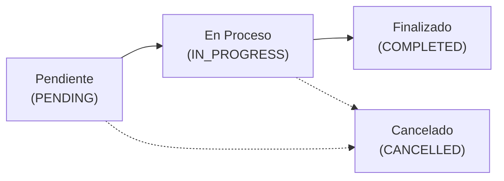

# Manual de Usuario: Sistema de Gestión para Taller de Motocicletas

> **Versión de la Aplicación:** 1.0.0  
> **Público Objetivo:** Administradores, Mecánicos, Recepcionistas y Personal de Caja  
> **Plataforma:** Aplicación Móvil (Android / iOS con Expo Go) y API Backend  
> **Fecha de Publicación:** Octubre 2026  

---

## Tabla de Contenidos
1. [Introducción y Bienvenida](#1-introducción-y-bienvenida)
   - [1.1 ¿Qué es este sistema?](#11-qué-es-este-sistema)
   - [1.2 Perfiles y Roles en el Taller](#12-perfiles-y-roles-en-el-taller)
   - [1.3 Matriz de Accesos y Permisos](#13-matriz-de-accesos-y-permisos)
2. [Acceso al Sistema y Primeros Pasos](#2-acceso-al-sistema-y-primeros-pasos)
   - [2.1 Requisitos y Conexión de Red](#21-requisitos-y-conexión-de-red)
   - [2.2 Inicio de Sesión (Login)](#22-inicio-de-sesión-login)
   - [2.3 Panel de Control y Navegación](#23-panel-de-control-y-navegación)
   - [2.4 Cierre de Sesión Seguro](#24-cierre-de-sesión-seguro)
3. [Módulo de Clientes](#3-módulo-de-clientes)
   - [3.1 Directorio y Búsqueda de Clientes](#31-directorio-y-búsqueda-de-clientes)
   - [3.2 Registro de un Nuevo Cliente](#32-registro-de-un-nuevo-cliente)
   - [3.3 Consulta y Edición de Ficha de Cliente](#33-consulta-y-edición-de-ficha-de-cliente)
   - [3.4 Eliminación de Clientes y Advertencias](#34-eliminación-de-clientes-y-advertencias)
4. [Módulo de Motocicletas](#4-módulo-de-motocicletas)
   - [4.1 Consulta de Motocicletas en Taller](#41-consulta-de-motocicletas-en-taller)
   - [4.2 Registro de una Nueva Motocicleta](#42-registro-de-una-nueva-motocicleta)
   - [4.3 Búsqueda Rápida por Placa o Propietario](#43-búsqueda-rápida-por-placa-o-propietario)
   - [4.4 Ficha Vehicular e Historial de Reparaciones](#44-ficha-vehicular-e-historial-de-reparaciones)
5. [Módulo de Órdenes de Servicio (Taller)](#5-módulo-de-órdenes-de-servicio-taller)
   - [5.1 Ciclo de Vida de una Reparación](#51-ciclo-de-vida-de-una-reparación)
   - [5.2 Apertura de una Nueva Orden](#52-apertura-de-una-nueva-orden)
   - [5.3 Actualización de Estado Operativo](#53-actualización-de-estado-operativo)
   - [5.4 Asignación de Repuestos con Descuento de Stock](#54-asignación-de-repuestos-con-descuento-de-stock)
   - [5.5 Reintegro de Repuestos al Inventario](#55-reintegro-de-repuestos-al-inventario)
   - [5.6 Desglose de Costos (Mano de Obra + Piezas)](#56-desglose-de-costos-mano-de-obra--piezas)
6. [Módulo de Repuestos e Inventario (Almacén)](#6-módulo-de-repuestos-e-inventario-almacén)
   - [6.1 Catálogo y Búsqueda de Repuestos](#61-catálogo-y-búsqueda-de-repuestos)
   - [6.2 Semáforo de Stock (Normal, Bajo y Crítico)](#62-semáforo-de-stock-normal-bajo-y-crítico)
   - [6.3 Creación y Edición de Piezas en Catálogo](#63-creación-y-edición-de-piezas-en-catálogo)
   - [6.4 Registro de Movimientos Manuales (Entradas y Salidas)](#64-registro-de-movimientos-manuales-entradas-y-salidas)
   - [6.5 Auditoría: Historial de Uso en Servicios](#65-auditoría-historial-de-uso-en-servicios)
7. [Módulo de Finanzas, Cobros y Pagos](#7-módulo-de-finanzas-cobros-y-pagos)
   - [7.1 Tablero de Control e Indicadores (KPIs)](#71-tablero-de-control-e-indicadores-kpis)
   - [7.2 Monitoreo de Estados de Cobro](#72-monitoreo-de-estados-de-cobro)
   - [7.3 Registro de Abonos y Pagos](#73-registro-de-abonos-y-pagos)
   - [7.4 Libro de Transacciones Históricas](#74-libro-de-transacciones-históricas)
8. [Módulo de Administración de Personal y Roles](#8-módulo-de-administración-de-personal-y-roles)
   - [8.1 Gestión de Cuentas de Personal](#81-gestión-de-cuentas-de-personal)
   - [8.2 Configuración de Roles y Asignación de Permisos](#82-configuración-de-roles-y-asignación-de-permisos)
   - [8.3 Reglas de Protección del Administrador](#83-reglas-de-protección-del-administrador)
9. [Preguntas Frecuentes y Solución de Problemas](#9-preguntas-frecuentes-y-solución-de-problemas)

---

## 1. Introducción y Bienvenida

### 1.1 ¿Qué es este sistema?
El **Sistema de Gestión para Taller de Motocicletas** es una aplicación móvil conectada en tiempo real con una base de datos centralizada. Su objetivo es reemplazar los cuadernos físicos, fichas en papel y hojas de cálculo dispersas mediante una experiencia ágil en smartphones y tablets.

Con esta aplicación podrás:
- Atender a los clientes y registrar sus motocicletas en segundos.
- Crear y dar seguimiento a las reparaciones y servicios técnicos.
- Controlar con exactitud el inventario de repuestos, sabiendo siempre cuántas unidades quedan y recibiendo alertas cuando se estén agotando.
- Saber exactamente cuánto debe cada cliente, registrar abonos y tener un control claro de las finanzas del taller.

---

### 1.2 Perfiles y Roles en el Taller
Para garantizar orden y seguridad, el sistema cuenta con permisos específicos. Cada empleado inicia sesión con su propia cuenta y accede únicamente a las opciones correspondientes a su trabajo:

1. **Administrador:**
   - Dueño o encargado general del taller.
   - Tiene acceso total a todas las funciones operativas, reportes de dinero, creación de empleados y configuración de roles.
2. **Mecánico / Jefe de Taller:**
   - Enfocado en el trabajo técnico dentro del taller.
   - Consulta clientes, registra motocicletas, abre y actualiza órdenes de servicio, descuenta repuestos del inventario conforme los instala en las motos.
3. **Recepcionista / Cajero:**
   - Enfocado en la atención al público y cobros.
   - Registra nuevos clientes, toma notas de fallas de motos, recibe abonos/pagos y genera recibos.

---

### 1.3 Matriz de Accesos y Permisos

| Permiso del Sistema | Módulo Asociado | Administrador | Mecánico | Recepcionista / Cajero |
| :--- | :--- | :---: | :---: | :---: |
| `manage_users` | Personal y Cuentas | Sí | No | No |
| `manage_roles` | Roles y Permisos | Sí | No | No |
| `manage_clients` | Directorio de Clientes | Sí | Sí | Sí |
| `manage_motorcycles` | Registro de Motocicletas | Sí | Sí | Sí |
| `manage_services` | Órdenes de Trabajo | Sí | Sí | Solo consulta |
| `manage_parts` | Almacén y Repuestos | Sí | Sí | Consulta |
| `manage_finances` | Caja, Cobros y Deudas | Sí | No | Sí |

> **Nota:** La aplicación adapta automáticamente los botones del menú según el usuario. Si tu cuenta no tiene asignado un permiso, ese módulo simplemente no aparecerá en tu pantalla de inicio.

---

## 2. Acceso al Sistema y Primeros Pasos

### 2.1 Requisitos y Conexión de Red
Para utilizar la aplicación en el taller:
1. Tu teléfono móvil o tablet debe estar conectado a la **misma red Wi-Fi** donde está funcionando la computadora servidora del taller.
2. Abre la aplicación **Expo Go** (o el acceso directo del taller si está instalada de forma nativa).

---

### 2.2 Inicio de Sesión (Login)
1. Al abrir la app, se mostrará la pantalla de bienvenida **"Iniciar Sesión"**.
2. Ingresa tu **Correo electrónico** registrado (ejemplo: `admin@taller.com` o el correo personal asignado por el administrador).
3. Escribe tu **Contraseña**.
4. Presiona el botón verde **"Iniciar Sesión"**.

```
+--------------------------------------+
|       TALLER DE MOTOCICLETAS         |
|                                      |
|  Correo Electrónico:                 |
|  [ admin@taller.com                ] |
|                                      |
|  Contraseña:                         |
|  [ ••••••••••••••••                ] |
|                                      |
|  [    INICIAR SESIÓN (Botón)       ] |
+--------------------------------------+
```

> **Credenciales Iniciales de Fábrica:**  
> Si es la primera vez que se inicia el sistema:  
> - **Correo:** `admin@taller.com`  
> - **Contraseña:** `password`  
> *(El Administrador debe crear las cuentas individuales de los empleados desde el panel).*

---

### 2.3 Panel de Control y Navegación
Al autenticarte correctamente, la aplicación te redirigirá a tu pantalla principal:
- **Si eres Administrador:** Ingresarás al **Panel de Administración**, donde podrás ver la lista del personal registrado, accesos directos a todos los módulos y la gestión de roles.
- **Si eres Mecánico o Personal Operativo:** Ingresarás al **Panel de Control**, con tarjetas directas hacia los módulos a los que tienes permiso:
  - 👥 **Gestión de Clientes**
  - 🏍️ **Gestión de Motocicletas**
  - 🔧 **Órdenes de Servicio**
  - 📦 **Repuestos e Inventario**
  - 💵 **Finanzas y Pagos**

Para ingresar a cualquier módulo, presiona el botón **"Ingresar al Módulo"** ubicado en cada tarjeta.

---

### 2.4 Cierre de Sesión Seguro
En la esquina superior derecha de la barra de navegación siempre encontrarás el botón rojo **"Cerrar Sesión"**.  
Al presionarlo, tu sesión se cerrará de inmediato y tus credenciales temporales se eliminarán del teléfono, evitando que otra persona use tu cuenta.

---

## 3. Módulo de Clientes

Este módulo permite llevar el control de todas las personas que solicitan servicios en el taller.

```
       [ + Agregar nuevo cliente ]
       [ Buscar por nombre, teléfono... ]
       
 Filtros: [ (Todos) ]  [ Con deuda ]  [ Frecuentes ]
 
 +---------------------------------------------------+
 | Juan Pérez                                        |
 | Correo: juan@gmail.com                            |
 | Servicios Activos: 2                              |
 | Dinero de deuda: $35.00                           |
 |            [ Editar ]   [ Eliminar ]              |
 +---------------------------------------------------+
```

### 3.1 Directorio y Búsqueda de Clientes
1. En la parte superior encontrarás una barra de búsqueda: escribe el nombre, teléfono o correo del cliente para encontrarlo en tiempo real.
2. Debajo encontrarás 3 filtros rápidos:
   - **Todos:** Lista cronológica de clientes.
   - **Con deuda:** Muestra únicamente a los clientes que tienen un saldo pendiente por pagar de servicios anteriores.
   - **Frecuentes:** Ordena a los clientes según el número de veces que han traído motocicletas al taller.

---

### 3.2 Registro de un Nuevo Cliente
1. Presiona el botón verde **"Agregar nuevo cliente"** en la parte superior.
2. Completa los datos en el formulario:
   - **Nombre completo** *(Obligatorio)*: Nombre y apellido del cliente.
   - **Teléfono** *(Obligatorio)*: Número de 8 dígitos de contacto para notificarle avances o cuando su moto esté lista.
   - **Correo electrónico** *(Opcional)*: Debe tener formato válido (ej. `cliente@correo.com`).
   - **Dirección** *(Opcional)*: Dirección o zona de residencia.
3. Presiona **"Guardar Cliente"**. Si algún dato es incorrecto, el sistema te avisará en pantalla.

---

### 3.3 Consulta y Edición de Ficha de Cliente
- **Ver Información:** Toca sobre la tarjeta del cliente para abrir su ficha completa (`ClientInformation`), donde podrás ver sus motos registradas y servicios históricos.
- **Editar:** Presiona el botón **"Editar"** en la tarjeta para actualizar su número de teléfono, dirección o correo.

---

### 3.4 Eliminación de Clientes y Advertencias
Si un cliente ya no asiste al taller o fue registrado por error:
1. Presiona el botón rojo **"Eliminar"**.
2. Aparecerá una alerta de confirmación con la advertencia:  
   *`"¿Seguro que quieres eliminar a [Nombre]? Eliminar a este cliente eliminará todos sus servicios y motocicletas asociadas."`*
3. Presiona **"Sí"** solo si estás seguro de proceder.

---

## 4. Módulo de Motocicletas

Permite registrar las motocicletas de los clientes con su respectiva placa, marca, modelo y año.

### 4.1 Consulta de Motocicletas en Taller
Al ingresar al módulo verás todas las unidades registradas. En cada tarjeta se muestra:
- Marca y Modelo (ejemplo: *Yamaha MT-03* o *Honda CB 190R*).
- Placa / Matrícula visible en un distintivo gris.
- Año de fabricación.
- Nombre y teléfono del cliente propietario.

---

### 4.2 Registro de una Nueva Motocicleta
1. Presiona el botón verde **"Registrar Motocicleta"**.
2. Selecciona o vincula al **Cliente Propietario**.
3. Ingresa la **Marca** (ej. *Suzuki*, *Bajaj*, *Italika*).
4. Ingresa el **Modelo** (ej. *Pulsar NS 200*).
5. Ingresa el **Año** (ej. *2022*). Debe ser un año razonable entre 1950 y el año próximo.
6. Ingresa la **Placa** (ej. *M-542198*).
   > **Aviso de Placa Única:** El sistema valida que la placa no pertenezca a otra motocicleta ya guardada. Si la placa ya existe, se mostrará un mensaje de advertencia.
7. Presiona **"Guardar Motocicleta"**.

---

### 4.3 Búsqueda Rápida por Placa o Propietario
Usa el buscador superior para escribir la placa completa o parcial (ej. `M-54`) o el nombre del dueño. Esto resulta especialmente útil en la recepción cuando una moto llega al taller y necesitas ubicarla de inmediato.

---

### 4.4 Ficha Vehicular e Historial de Reparaciones
Al tocar una motocicleta ingresarás a su **Ficha Detallada** (`MotorcycleDetailScreen`).  
Allí podrás ver:
1. Datos técnicos completos del vehículo.
2. Datos de contacto del dueño con botón para llamarle.
3. **Historial de Servicios Anteriores:** Una línea de tiempo con todas las órdenes de trabajo que ha tenido esa moto en el taller, fechas, repuestos cambiados y costos cobrados.

---

## 5. Módulo de Órdenes de Servicio (Taller)

El corazón operativo del taller. Administra los diagnósticos, mantenimientos, reparaciones y el consumo de piezas.



### 5.1 Ciclo de Vida de una Reparación
Cada orden pasa por distintos estados:
- **Pendiente (`PENDING`):** La moto ingresó al taller, se describió el trabajo pero aún no se empieza a reparar.
- **En proceso (`IN_PROGRESS`):** El mecánico está trabajando en la motocicleta.
- **Finalizado (`COMPLETED`):** La reparación concluyó exitosamente y la moto está lista para entrega y cobro.
- **Cancelado (`CANCELLED`):** El cliente desistió del trabajo. No permite agregar más repuestos ni registrar cobros.

---

### 5.2 Apertura de una Nueva Orden
1. En la pantalla de **Órdenes de Servicio**, presiona **"Nueva Orden"**.
2. Selecciona la motocicleta a reparar buscando por placa o cliente.
3. Escribe la **Descripción del Trabajo** (ejemplo: *"Mantenimiento preventivo de los 10,000 km, cambio de aceite y regulación de frenos"*).
4. Define el **Costo de Mano de Obra** inicial (ejemplo: `$25.00`).
5. Presiona **"Crear Orden"**.

---

### 5.3 Actualización de Estado Operativo
Al abrir una orden de servicio, en la parte superior verás el selector de estado con botones para alternar entre **"Pendiente"**, **"En proceso"** y **"Finalizado"**.  
Toca el botón correspondiente para actualizar el estado del trabajo. Esto permite que todo el personal sepa en qué fase está la motocicleta sin necesidad de preguntarle al mecánico.

---

### 5.4 Asignación de Repuestos con Descuento de Stock
Cuando el mecánico utiliza repuestos del taller (aceite, bujías, pastillas de freno, cables, etc.):
1. Dentro del detalle de la orden, ve a la sección **"Repuestos Utilizados"**.
2. Presiona el botón **"+ Asignar Repuesto"**.
3. Se abrirá una ventana emergente:
   - Elige el repuesto del catálogo (la lista te muestra el código y cuántas piezas hay disponibles en almacén).
   - Escribe la **Cantidad** utilizada (ej. `1` o `2`).
4. Presiona **"Asignar a la Orden"**.
5. **¿Qué sucede internamente?**
   - El inventario físico se descuenta automáticamente.
   - Queda guardada la bitácora indicando qué mecánico consumió la pieza.
   - El precio del repuesto se suma de inmediato al total de la orden.

> **Importante:** Si intentas asignar más piezas de las que existen en almacén (por ejemplo, pides 5 bujías pero solo hay 2 en bodega), el sistema rechazará la acción informando: *"Stock insuficiente"*.

---

### 5.5 Reintegro de Repuestos al Inventario
Si por error asignaste una pieza equivocada o el cliente prefirió no cambiarla:
1. En la lista de repuestos de la orden, localiza la pieza.
2. Presiona el botón del bote de basura (eliminar).
3. El sistema devolverá automáticamente las piezas al inventario en bodega y restará el costo del total de la orden.

---

### 5.6 Desglose de Costos (Mano de Obra + Piezas)
La tarjeta de la orden muestra con claridad matemática el cobro total:
$$\text{Total a Pagar} = \text{Costo Mano de Obra} + \text{Suma de Repuestos Instalados}$$
De esta manera, el cliente recibe un presupuesto transparente donde puede ver cuánto corresponde al trabajo técnico y cuánto a las refacciones.

---

## 6. Módulo de Repuestos e Inventario (Almacén)

Permite administrar el catálogo de piezas y consumibles del taller, controlar existencias y auditar movimientos.

```
+-------------------------------------------------------------+
| [ Catálogo y Stock ]              [ Historial en Servicios ] |
+-------------------------------------------------------------+
| [ Buscar por código o nombre...                           ] |
|                                                             |
| Stock Actual                                   [ + Nuevo ]  |
|                                                             |
| [AC-102] Aceite 20W50                          $8.50        |
| Stock: 18 unidades (Mín: 10)                  [ NORMAL ]    |
|                                                             |
| [FR-045] Pastillas de freno                    $12.00       |
| Stock: 2 unidades (Mín: 10)                   [ CRÍTICO ]   |
|                                                             |
| ----------------------------------------------------------- |
| Ajuste Manual de Stock:                                     |
| Seleccionado: Pastillas de freno                            |
|       [ Entrada (+ Compra) ]    [ Salida (- Merma) ]        |
+-------------------------------------------------------------+
```

### 6.1 Catálogo y Búsqueda de Repuestos
En la pestaña **"Catálogo y Stock"**:
- Utiliza la barra de búsqueda para ubicar repuestos por su código SKU (ejemplo: `AC-102`) o por su nombre (ejemplo: *aceite*, *batería*).
- La lista te mostrará el precio de venta unitario, el stock actual y el umbral de stock mínimo.

---

### 6.2 Semáforo de Stock (Normal, Bajo y Crítico)
Cada repuesto cuenta con una insignia de color que te indica su estado en almacén:
- 🟢 **NORMAL (OK):** Hay suficiente existencia en bodega (mayor al stock mínimo).
- 🟡 **BAJO (LOW):** La existencia es igual o menor al stock mínimo. Es momento de hacer pedido a proveedores.
- 🔴 **CRÍTICO (CRITICAL):** El repuesto está totalmente agotado (0 unidades) o queda menos de la mitad del mínimo configurado. Requiere compra urgente.

---

### 6.3 Creación y Edición de Piezas en Catálogo
- **Crear un nuevo repuesto:**
  1. Presiona el botón verde **"+ Nuevo"**.
  2. Llena el formulario:
     - **Código / SKU:** Identificador único sin espacios (ej. `LUB-01`, `CAD-428`).
     - **Nombre:** Denominación clara de la pieza.
     - **Precio ($):** Precio unitario que se cobrará al cliente.
     - **Stock Inicial:** Cantidad física que tienes en bodega hoy.
     - **Stock Mínimo:** Nivel de advertencia (por defecto 10 unidades).
     - **Descripción:** Detalles técnicos adicionales.
  3. Presiona **"Guardar"**.
- **Editar repuesto:**
  - Toca el repuesto en la lista y presiona el botón de lápiz/editar para cambiar su precio de venta o stock mínimo.

---

### 6.4 Registro de Movimientos Manuales (Entradas y Salidas)
Cuando compras nuevas piezas o necesitas ajustar el inventario fuera de una orden:
1. En la lista, **toca el repuesto** que deseas mover (quedará resaltado).
2. En la parte inferior verás dos botones:
   - 📥 **Entrada:** Úsalo cuando llegue un pedido de refacciones del proveedor.
     - Escribe la cantidad recibida y el motivo (ejemplo: *"Factura de compra #1042"*).
     - El stock se sumará de inmediato.
   - 📤 **Salida:** Úsalo si una pieza se dañó, venció o se vendió directamente por mostrador.
     - Escribe la cantidad que sale y el motivo (ejemplo: *"Pieza defectuosa devuelta a garantía"*).
     - El stock se restará. Si intentas sacar más unidades de las disponibles, el sistema no lo permitirá.

---

### 6.5 Auditoría: Historial de Uso en Servicios
Toca la pestaña superior **"Historial en Servicios"**:
- Esta vista te muestra exactamente **dónde, cuándo y quién** ha usado repuestos del taller.
- Verás: qué pieza se utilizó, en qué orden de servicio (#), para qué motocicleta (marca, modelo y placa) y a qué cliente pertenecía.
- Incluye un resumen de cuántas piezas se han consumido y el monto total en dinero generado por refacciones.

---

## 7. Módulo de Finanzas, Cobros y Pagos

Diseñado para llevar el control del dinero del taller, monitorear deudas y asentar abonos de los clientes.

### 7.1 Tablero de Control e Indicadores (KPIs)
En la parte superior encontrarás 3 tarjetas con números clave del taller en tiempo real:
1. **Facturado Total:** Todo el dinero generado por órdenes de servicio no canceladas (mano de obra + refacciones).
2. **Total Recaudado (en verde):** Todo el dinero efectivamente cobrado en caja.
3. **Saldo por Cobrar (en rojo):** El dinero pendiente que los clientes aún le deben al taller.

---

### 7.2 Monitoreo de Estados de Cobro
En la pestaña **"Monitoreo de Servicios"** puedes filtrar las órdenes según su estado de pago:
- **Todos:** Lista general de órdenes.
- **Pendientes:** Órdenes donde el cliente aún no ha abonado ni un centavo.
- **Parciales:** Órdenes donde el cliente dejó un anticipo pero aún debe saldo.
- **Pagados:** Órdenes completamente canceladas económicamente.

Cada tarjeta muestra con claridad:
- **Total:** Monto global de la orden.
- **Abonado:** Lo que el cliente ya pagó.
- **Saldo:** Lo que resta por cobrar.

---

### 7.3 Registro de Abonos y Pagos
Cuando un cliente llega a pagar o dejar un anticipo:
1. Localiza la orden de servicio en la lista y tócala para ingresar a **"Gestión de Pagos"**.
2. Verás el desglose económico de la moto y el saldo pendiente exacto.
3. En el formulario inferior completa:
   - **Monto a Abonar ($):** La cantidad de dinero que entrega el cliente.
   - **Método de Pago:** Selecciona entre **Efectivo**, **Tarjeta** o **Transferencia**.
   - **Notas:** Puedes escribir el número de referencia bancaria o comprobante.
4. Presiona el botón verde **"Registrar Pago"**.
5. **Regla de Seguridad Anti-Sobrepago:** Si la orden tiene un saldo pendiente de `$30.00` y el operador intenta registrar un pago de `$40.00`, el sistema bloqueará la transacción avisando:  
   *`"El monto ($40.00) supera el saldo pendiente ($30.00)"`*.

---

### 7.4 Libro de Transacciones Históricas
En la pestaña **"Historial de Pagos"** tendrás un registro cronológico de todas las entradas de dinero:
- Fecha y hora exacta del pago.
- Nombre del cliente y número de orden.
- Método de cobro utilizado (con iconos distintivos para efectivo, tarjeta o transferencia).
- Monto abonado con signo positivo (`+$25.00`).

---

## 8. Módulo de Administración de Personal y Roles

> **Módulo Exclusivo para el Administrador del Taller (`manage_users` y `manage_roles`).**

### 8.1 Gestión de Cuentas de Personal
En el **Panel de Administración** (`UserManagementScreen`):
- Verás a todos los empleados registrados con su nombre, correo y rol asignado.
- **Registrar Nuevo Usuario:**
  1. Presiona **"Registrar Usuario"**.
  2. Escribe su nombre completo, correo electrónico corporativo y una contraseña provisional (mínimo 6 caracteres).
  3. Selecciona el **Rol** que desempeñará en el taller (ej. *Mecánico*, *Cajero*, *Recepcionista*).
  4. Presiona **"Registrar Usuario"**.
- **Eliminar Cuenta:**
  - Si un empleado ya no labora en el taller, presiona **"Eliminar Usuario"** en su tarjeta para revocar su acceso inmediatamente.

---

### 8.2 Configuración de Roles y Asignación de Permisos
El sistema permite crear roles personalizados adaptados a la estructura del taller:
1. Presiona el botón **"Gestionar Roles"** en el panel de administración.
2. Para crear un nuevo rol, presiona **"+ Nuevo Rol"**:
   - Asigna un nombre al rol (ejemplo: *Jefe de Almacén*).
   - Escribe una breve descripción de sus funciones.
   - **Marca las casillas de verificación** de los módulos a los que tendrá acceso:
     - `manage_clients` (Ver y registrar clientes)
     - `manage_motorcycles` (Registrar y ver motocicletas)
     - `manage_services` (Gestionar órdenes técnicas)
     - `manage_parts` (Administrar refacciones)
     - `manage_finances` (Cobros y reportes)
     - `manage_users` / `manage_roles` (Permisos administrativos)
3. Presiona **"Guardar Rol"**. De inmediato, cualquier usuario que tenga ese rol verá reflejados sus permisos en su app.

---

### 8.3 Reglas de Protección del Administrador
Para prevenir fallos catastróficos o pérdidas accidentales de acceso al sistema:
1. **La cuenta de Administrador Principal (ID 1) no puede ser eliminada.** El botón de eliminación está deshabilitado y el backend rechazará cualquier intento.
2. **El Rol Administrador no puede ser eliminado ni despojado de sus permisos maestros.**
3. **No se puede eliminar un rol si aún tiene empleados vinculados.** Primero deberás reasignar a esos empleados a otro rol antes de poder borrarlo.

---

## 9. Preguntas Frecuentes y Solución de Problemas

### P1: La aplicación muestra "Error de Conexión con el Servidor". ¿Qué debo hacer?
**Causa:** La aplicación móvil no logra comunicarse con la computadora del taller donde está corriendo el servidor de Node.js.  
**Solución paso a paso:**
1. Comprueba que la computadora principal del taller esté encendida y ejecutando el comando `npm run dev` en la carpeta `backend/`.
2. Verifica que tu teléfono móvil esté conectado a la **misma red Wi-Fi** que la computadora (no uses datos móviles 4G/5G).
3. Si la computadora cambió de dirección IP (algo común al reiniciar el router Wi-Fi), solicita al encargado que actualice la IP en el archivo `frontend/.env` (en la variable `EXPO_PUBLIC_API_URL`).

---

### P2: Al intentar entrar a un módulo me sale "Acceso Denegado".
**Causa:** Tu rol de usuario no tiene asignado el permiso necesario para ese módulo.  
**Solución:** Contacta al Administrador del taller para que ingrese a **Gestión de Roles**, edite tu rol y active la casilla del módulo requerido.

---

### P3: No me permite agregar un repuesto a una orden de servicio.
**Posibles causas y soluciones:**
- **Stock insuficiente:** Almacén no tiene suficientes unidades físicas registradas. Revisa en el módulo de repuestos y registra una *Entrada* si compraste más piezas.
- **La orden está cancelada:** Si una orden de servicio está en estado *Cancelada*, el sistema bloquea cualquier adición de repuestos para evitar inconsistencias contables.

---

### P4: Un cliente tiene una motocicleta pero vendió el vehículo a otra persona. ¿Cómo se actualiza?
**Solución:** Ingresa a la motocicleta en el módulo **Gestión de Motocicletas**, presiona **"Editar"**, selecciona al nuevo cliente propietario en la lista y guarda los cambios. El historial técnico de reparaciones de la moto se conservará intacto.

---

### P5: ¿Puedo registrar pagos en dólares y transferencias bancarias?
**Solución:** Sí. En la pantalla de registro de abono puedes elegir el método de pago entre **Efectivo**, **Tarjeta** o **Transferencia**. En el campo de texto opcional puedes ingresar los últimos 4 dígitos de la transacción o el código de comprobante bancario para facilitar auditorías contables.

---

### P6: ¿Cómo cierro el día en el taller?
**Recomendación de Buenas Prácticas:**
1. Dirígete al módulo **Finanzas y Pagos**.
2. Revisa el valor de **Total Recaudado** y compáralo con el dinero en caja física y vouchers de tarjeta/transferencia.
3. Ve a la pestaña **Historial de Pagos** para verificar cada cobro registrado durante la jornada.
4. Presiona el botón superior rojo **"Cerrar Sesión"** en tu teléfono para mantener la seguridad de tu cuenta.
